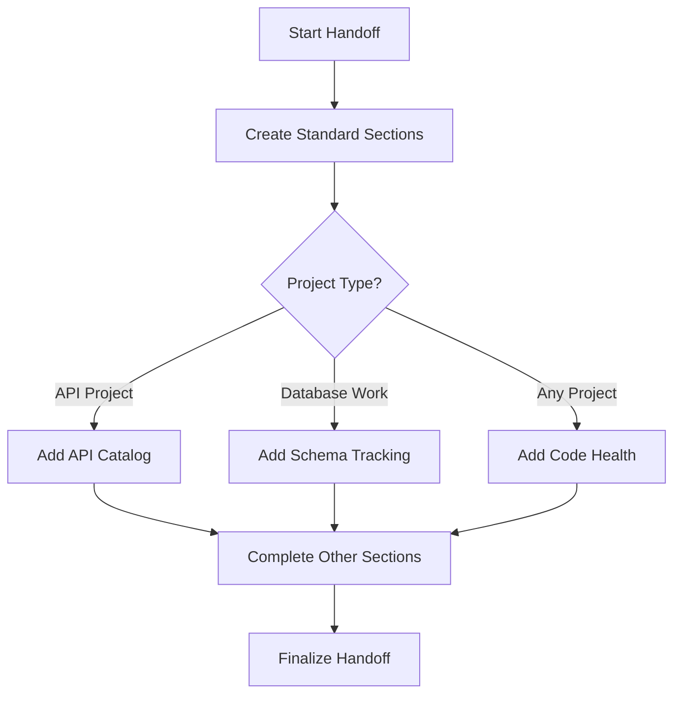

# Enhanced Handoff Templates

This document describes additional templates that can be used to enhance your handoff documents with more structured information about your project.

## Overview

The enhanced templates provide standardized formats for documenting important aspects of software development that are often overlooked in traditional handoffs, including:

- Code health metrics
- API documentation
- Database schema changes
- Dependency tracking
- Environment configuration
- Testing status

## Available Templates

| Template | Purpose | When to Use |
|----------|---------|-------------|
| [Code Health](../template-extensions/code-health-template.md) | Track code quality metrics | Every handoff |
| [API Catalog](../template-extensions/api-catalog-template.md) | Document API endpoints | When developing APIs |
| [Database Schema](../template-extensions/database-schema-template.md) | Track database changes | When modifying data models |
| [Dependency Changelog](../template-extensions/dependency-changelog-template.md) | Document package changes | When adding/updating dependencies |
| [Environment Config](../template-extensions/environment-config-template.md) | Track configuration changes | When modifying environment setup |
| [Testing Status](../template-extensions/testing-status-template.md) | Document test coverage | When implementing tests |

## Integration with Handoff Workflow

These templates are designed to integrate smoothly with the existing handoff workflow:



## Usage Guidelines

1. **Be Selective**: Only include templates relevant to the current work
2. **Be Consistent**: Use the same templates across related handoffs
3. **Be Precise**: Fill in actual metrics rather than estimates
4. **Be Concise**: Focus on changes, not static information

## Automation Support

The repository includes scripts to help with template management:

- `next-handoff-number.js`: Determines the next handoff number to use
- `knowledge-extractor.js`: Consolidates technical knowledge from handoffs
- `generate-workflow-diagram.js`: Creates standardized workflow diagrams
- `project-health-dashboard.js`: Generates metrics visualization

## Example: Complete Handoff

Here's a sample of a complete handoff document using multiple templates:

```markdown
# API Implementation Handoff - 2025-04-15

## Summary
Implemented user authentication API endpoints with JWT token support and rate limiting.

## Priority Development Requirements (PDR)
- **HIGH**: Add refresh token functionality
- **MEDIUM**: Implement unit tests for token validation
- **LOW**: Update API documentation for new endpoints

## Discoveries
- JWT library has memory leak when token verification fails
- Rate limiting works well at 100 req/min

## Problems & Solutions
- **Problem**: Token validation failing with timezone issues
  **Solution**: Standardized all dates to UTC in token payload

## Work in Progress
- Refresh token endpoint: 60% complete
- Rate limiting implementation: 100% complete
- Documentation: 40% complete

## Code Health Metrics
- **Test Coverage**: 72% (36/50 paths)
- **Linting Status**: Pass (0 issues)
- **Documentation**: 60% of public APIs documented
- **Technical Debt**: 5 TODOs in codebase
- **Performance**: Auth validation completes in 28ms

## API Endpoints Catalog
| Endpoint            | Method | Status      | Auth Required | Response Time | Notes |
|---------------------|--------|-------------|---------------|---------------|-------|
| `/api/auth/login`   | POST   | Implemented | No            | ~120ms        | Returns JWT |
| `/api/auth/refresh` | POST   | In Progress | Yes           | ~80ms         | Needs tests |

## Dependency Updates
- **Added**: `rate-limiter-flexible@2.4.1` - For API rate limiting
- **Upgraded**: `jsonwebtoken` 9.0.0 → 9.0.2 - Security fixes

## Environment Configuration
- **New Variables**: 
  - `RATE_LIMIT_MAX`: Maximum requests per window (default: 100)
  - `RATE_LIMIT_WINDOW_MS`: Time window in ms (default: 60000)

## References
- auth/jwt-service.js
- middleware/rate-limiter.js
```

## Recommended Next Steps

1. Review the templates and select those relevant to your project
2. Update your handoff creation process to include selected templates
3. Run the knowledge extractor periodically to consolidate information
4. Generate health dashboards to visualize project trends
